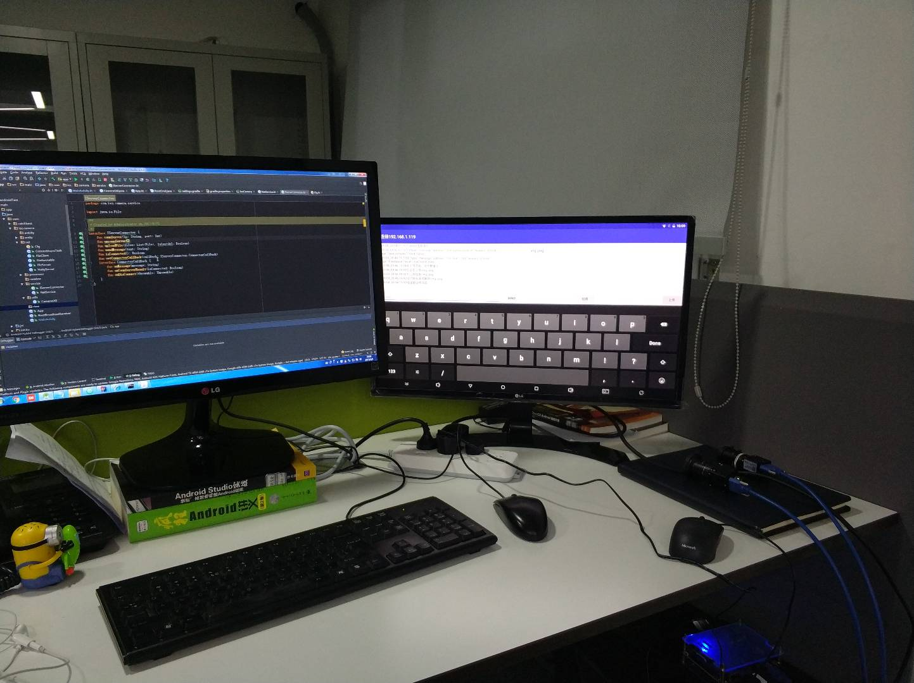
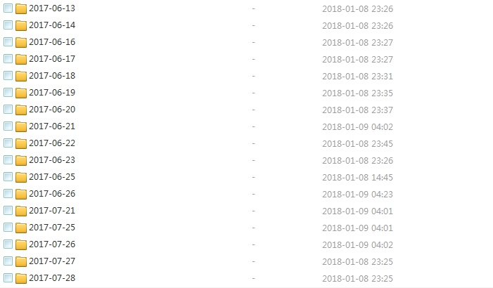

## 这是我学习python的过程中写的一些脚本,有管理手机照片的,opencv图片处理的,以及还有一些爬虫等等.文件太多,记录一下封边查阅.

### draw/draw.py (模仿画画)

一个模仿绘画风格的python脚本,它的效果大概是这样的:

原画

模板

### mehu/lapblas.py (OpenCV检测图片的清晰度)

利用OpenCV 的拉普拉斯函数 来检测图片是模糊还是清晰.

### ImgClassify.py (对海量的图片根据时间进行分类)

一年了,手机里拍的照片是贼多啊,由于手机上有月份排序的功能,拷出来全放在一个文件夹里感觉非常难查阅,而且用百度云上传到云端的话单文件夹只能500个文件,于是,写个脚本给照片按照年份月份分一下类吧.

### ZhiLian.py (利用python分析全国每个城市的职位数)

中国除了公认的北上广深工作机会最多以外,还有那些城市也相对不错呢?

这时候我们可能会打开招聘网站开始选择城市然后来了解这个城市的职位情况.

那么一直秉持着人生苦短,我学python的我们,为什么不能用python来写一个分析2018全国各个城市的职位数排名的爬虫脚本呢?

[实现过程详细介绍](http://imaster.top/2018/01/16/%E5%88%A9%E7%94%A8python%E5%88%86%E6%9E%902018%E6%99%BA%E8%81%94%E6%8B%9B%E8%81%98%E5%85%A8%E5%9B%BD%E5%90%84%E4%B8%AA%E5%9F%8E%E5%B8%82%E8%A1%8C%E4%B8%9A%E8%81%8C%E4%BD%8D%E6%95%B0%E6%8E%92%E5%90%8D/)
### csdn/CSDNDemo.py (爬虫刷CSDN访问量)

一不小心刷了10多万,赶紧停手[笑哭].

### csdn/CsdnFlow.py (CSDN自动关注其他用户)

想法来源于之前在github看到的一个项目,刷github的粉丝,原理是用python爬虫取到用户id批量关注,然后过一段时间检查有没有互粉,没有的话就批量取消关注.这个可以说是CSDN版吧...
ps：近期发现csdn已经换了https了，https也是可以抓包抓到请求头的，改了改脚本又能用了。只是要忽略下证书验证。
### csdn/CSDNSendMsg.py (CSDN自动发私信)

csdn这接口安全性真的是有问题，私信接口get请求，抓包直接能看到。。。，而且我发现有一部分接口还没有转到https上面。

### douban.py (获取豆瓣某部电影的所有影评)

爬虫用来练手的吧..

### douyutv.py (爬取网站图片然后下载)

也是用来练习写爬虫的.

### SdkBuidle.py 

android studio 辅助构建工具，项目打包的时候需要进行频繁的拷贝，运行dx命令等，十分重复繁琐，脚本通过调用gradlew打包sdk相关文件。
